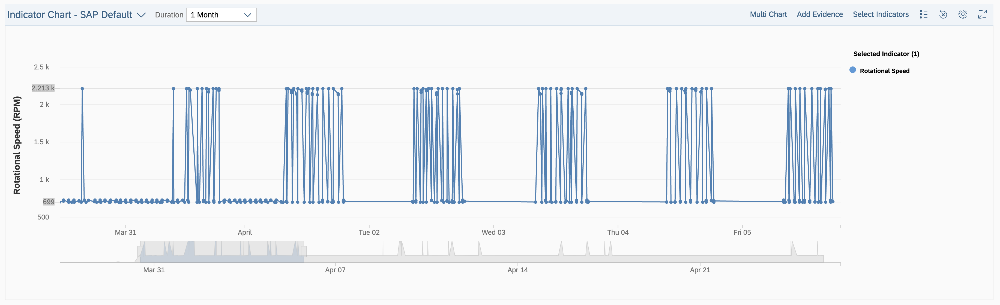
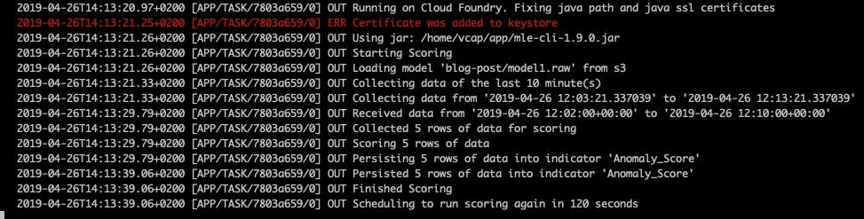

# Description

SAP Predictive Maintenance and Service enables customers to deploy custom machine learning algorithms e.g. for improved failure prediction or anomaly detection, but also to address additional use cases not covered by the standard product.
The sample implementation shows how the Python-based coding for a custom machine learning algorithm is deployed on SAP Cloud Platform Cloud Foundry. The SAP Predictive Maintenance and Service, machine learning extension is used to retrieve the data from the SAP Predictive Maintenance and Service tenant and to upload the scores of the algorithm back into the system, where the scores are modelled as indicator for further use.

In the provided example, we show the monitoring of the rotational speed of a Pump that uses operating modes. This is a very
simple use case, that could also be achieved in many other ways. The purpose of the example is to show the deployment of the algorithm (gaussian kernel density estimator) - the algorithm itself could be exchanged with more complex ones to adapt the model to your use case. We assume the pump is equipped with one sensor that measures the rotational speed. As the pump has two operational modes, the algorithm should be able to detect if the pump is in one of those two modes, otherwise the algorithm should output a high
anomaly score. 

The modes and related sensor data can be seen in the following screenshot of the PdMS Indicator Chart:



As it can be seen, the readings are either around the value of 700 or around the value of 2200.

# Requirements

The code in this repository is made for use with SAP Predictive Maintenance and Service, cloud edition and the SAP Predictive Maintenance and Service, machine learning engine extension.

The machine learning extension requires a Java runtime environment. Since the extension algorithm used for demo purposes here is developed in Python, a Python runtime (Python 3.6.x) is required as well. 

# Download and Installation

You can use the sample code provided here either for executing locally or on SAP Cloud Platform, Cloud Foundry.

## Run locally

To run the application locally, use the pip package manager to install the requirements with the command below. Make sure that python 3.6.x and Java are installed.

```
$ pip install -r requirements.txt
```
The usage of the SAP Predictive Maintenance and Service, machine learning extension requires API access to the underlying Asset Central Foundation and SAP Leonardo IoT (SAP IoT Application Enablement). You can create the service keys from the CF Marketplace in the subdomain that is subscribed to Asset Central Foundation and SAP Leonardo IoT (SAP IoT Application Enablement) using the commands cf marketplace, cf create-service, cf create-service-key and retrieve it using cf service-key.

Set the environment variables AC_KEY (Asset Central Foundation service key), IOT_KEY (Leonardo IoT service key) and 
S3_KEY (Object Store service key) and start training, scoring or scheduled scoring with:

* `python app.py train` 
* `python app.py score` 
* `python app.py score-scheduled`

## Run On Cloud Foundry

To control the application, the Cloud Foundry tasks framework is used. Before deploying the application, add the values of the
service keys to the `manifest.yml` file.
Afterwards, the application can be deployed with `cf push` and can be stopped afterwards with `cf stop`.

Training can be triggered with `cf run-task extensibility-ml-app "python app.py train"` and scoring with
`cf run-task extensibility-ml-app "python app.py score"`.
Scheduled scoring is possible with 
`cf run-task extensibility-ml-app "python app.py score-scheduled"`. In scheduled mode, the application stays running, polls for
new data every 120 seconds and computes the anomaly scores.
To stop the scheduled scoring, run `cf terminate-task extensibility-ml-app <task-id>`.

While training or scoring, the logs can be observed with `cf logs extensibility-ml-app`.




# Configuration

In order to run the application, you first need to provide the keys for the backend services being used:
* AC_KEY - Asset Central Foundation service key
* IOT_KEY - Leonardo IoT service key
* S3_KEY - Object Store service key

For running the algorithm locally, set environment variables accordingly. For deployment on Cloud Foundry, add the values of the service keys to the `manifest.yml` file.

# How to obtain support

The code is provided as-is without support.

# License

Copyright (c) 2019 SAP SE or an SAP affiliate company. All rights reserved. This project is licensed under the Apache Software License, version 2.0 except as noted otherwise in the [LICENSE](License) file.
